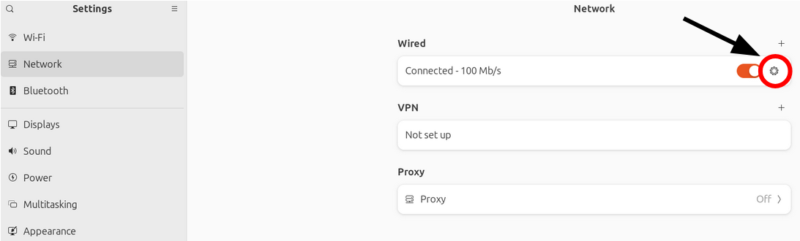

TODO : Ce fichier sera à transformer en PDF

# 0 - Introduction

Ce projet a pour objectif :

Deux parties composent ce projet :
- **client_ws** : contient le code source du client web, c'est à dire le site web qui affiche le flux vidéo de la caméra et les données de télémétrie du robot, à lancer sur un navigateur web, programme indépendant.
- **robot_ws** : contient le code source à lancer sur le robot, c'est à dire toute la structure logique du robot : caméra, navigation, motorisation, connexions avec l'interface web, etc.


# 1 - Configuration

## 1.1 Prérequis - À installer

### 1.1.a - Prérequis materiels

- Plateforme robot mobile Curt-Mini de Franhoffer.
- Camera IP Reolink E560P branchée en ethernet au robot.
- GPS RTK U-blox (module rover) branché en USB au robot.
- GPS RTK U-blox (module base) branché en USB à un ordinateur ou adaptateur 5V, à positionner à un endroit fixe dans St-Cyr (sur le toit du local avec les bonbonnes de gazoil, car le système de navigation a été étalonné sur cette position : 
48.80393950° 2.07576810°).

### 1.1.b - Prérequis logiciels

- Linux (Ubuntu recommande).
- ROS2 Jazzy installé.
- Python3 et colcon installés.
- OpenCV + cv_bridge.
- rosbridge_server pour la communication web.
- Outils utilitaires : arp-scan, curl, net-tools (ou ss).

### 1.1.c - Prérequis Bibliothèques ROS2 à installer

Verifier que ces packages suivants sont installés :

- rclpy
- std_msgs
- geometry_msgs
- sensor_msgs
- std_srvs
- tf2_ros
- robot_localization
- nav2
- ros2_control / ros2_controllers
- twist_mux
- rosbridge_server

### 1.1.d - Configuration initiale (a faire une fois)

### Structure attendue

Télécharger nos projets sur vos machines respectives, on distinguera l'ordinateur de bord du robot `R:\` et l'ordinateur du client (depuis lequel le site web sera accessible et lancé `C:\` ) organisez-les dans vos espaces de travail ROS2 (ex: `~/Bureau/robot_ws/`) de la manière suivante :

- ` ~R:/Bureau/robot_ws/robot_ws`
- ` ~C:/Bureau/robot_ws/client_ws`

### Configurer le profil de connexion filaire pour la caméra

Une fois la caméra Reolink branchée en Ethernet sur le PC Robot, dans les paramètres des connexions réseaux, plus particulièrement les connexions filaires, aller dans les réglages (roue dentée) de la connexion Ethernet.



Dans l'onglet Details, cochez les cases :
* Connect automatically
* Make avaible to others users

Et donc l'onglet IPV4, séléctionnez :
* Shared to other computers

Cela aura pour effet de configurer une IP statique sur le PC Robot (ex: `10.42.0.1`) et de permettre à la caméra d'obtenir une IP dans le même sous-réseau (ex: `10.42.0.188`).

### Configuration Tailscale pour la connexion à distance entre les 2 ordinateurs

1. Installer Tailscale sur les 2 machines (client et robot).
2. Se connecter avec le même compte Tailscale sur les 2 machines.
3. Vérifier que les 2 machines sont connectées et visibles dans l'interface Tailscale.
4. **Noter les IP Tailscale attribuées à chaque machine (ex: `100.x.y.z`).**, elles seront à remplacer dans les fichiers de configuration du projet (voir section 1.2.a).
5. Tester la connectivité en pingant l'IP Tailscale de l'autre machine depuis chaque machine.


### Verification reseau avant mission

```bash
ip a
ss -ltn | grep -E "(8000|8554|9090)"
```

Verifier que la camera et la machine de controle sont sur le meme sous-reseau.


## 1.2 Configuration récurrente (pouvant changer d'un lancement à l'autre)

Différents éléments peuvent changer d'un lancement à l'autre, dont les modifications ne sont pas automatisées, on retrouve : 
- l'IP Tailscale de chaque machine

### 1.2.a - IP Tailscale

À renseigner côté client : 
    Mettre l'ip Tailscale du robot dans : 
    - `client_ws/configuration.yml` à la ligne 4.
    - `client_ws/web_control/web_control/camera_publisher.py` à la ligne 18.
    - `client_ws/web_control/web_control/capture_manager.py` à la ligne 32.

À renseigner côté robot :
    Mettre l'ip Tailscale du client dans : 

## 1.3 Configuration utilisateur

Si vous souhaitez personnaliser les paramètres de navigation ou les réglages de la caméra, voici les fichiers de configuration ou les méthodes à connaitre :

> **Camera** :
Si on veut personnaliser les réglages de la caméra (ex: résolution, framerate, etc), on peut y accéder en lancant l'IP de la caméra comme URL dans un navigateur web (ex: `http://10.42.0.188`), puis en se connectant avec les identifiants (ex: admin:ros2_2025). Ensuite, dans les paramètres de la caméra, on peut configurer la résolution, le framerate, etc.

Plus pariculièrement dans les paramètres : 
Camera > Stream > Clear : Baisser la résolution, le FPS ou le bitrate peut aider à réduire la latence du flux vidéo, mais au détriment de la qualité d'image.


# 2 - Utilisation

Cette section decrit une sequence de lancement recommandee basee sur l'analyse des dossiers src.

## 2.1 Lancement du robot (robot_ws)


Dans un premier terminal :
```bash
# Connexion à tailscale (génèralement permanente)
sudo tailscale up
# Lancement de tous les noeuds du robot
cd ~/Bureau/robot_ws/robot_ws
colcon build
source install/setup.bash
ros2 launch curt_mini simulation.xml
```

Dans un deuxième terminal :
```bash
# Lancement de la re-transcription du flux vidéo
cd ~/Bureau/robot_ws/mediamtx
./mediamtx
```

Ce lancement orchestre notamment :
- Création d'un VPN entre l'ordinateur de bord du robot et l'ordinateur client via Tailscale.
- la base robot (ros2_control, candle_ros2, curt_mini),
- la localisation (EKF local/global + navsat transform),
- la navigation Nav2,
- le serveur d'actions de trajectoires.
- la simulation Gazebo (si `simulation.xml` est lance).
- Re-transcription du flux vidéo RTSP de la caméra en un flux WebSocket accessible par le client web.

## 2.2 Lancement de l'interface web (client_ws)

Sur l'ordinateur du cilent, dans un terminal :
```bash
# Connexion à tailscale (génèralement permanente)
sudo tailscale up
# Lancement du site web
cd ~/Bureau/robot_ws/client_ws
colcon build
source install/setup.bash
ros2 launch web_control web_control_full.launch.py
```

Ce lancement demarre :
- rosbridge websocket (communication navigateur <-> ROS2)
- le backend web (serveur HTTP, capture photo/video, galerie, trajectoires).

## 2.3 Verification rapide post-demarrage

```bash
ros2 node list
ros2 topic list
```

Topics utiles a verifier :
Cote robot :

(mettre image)

Cote client : 

## 2.4 Acces interface

- Interface principale : `http://localhost:8000/`
- Navigation : `http://localhost:8000/navig/`
- Terminal web : `http://localhost:8000/terminal/`

## 2.5 Commandes de test utiles

```bash
# Photo
ros2 service call /camera/take_photo std_srvs/srv/Trigger

# Debut enregistrement video
ros2 service call /camera/start_video std_srvs/srv/Trigger

# Arret enregistrement video
ros2 service call /camera/stop_video std_srvs/srv/Trigger

# Arret d'urgence
ros2 topic pub /robot/emergency_stop std_msgs/msg/Bool "{data: true}" --once
```

# 3 - Contenu détaillé du projet

## Contenu - client_ws

Le package principal analyse dans `client_ws/src` est `web_control`.

### 3.1 Architecture de web_control

- `web_control/launch/web_control_full.launch.py` : lancement coordonne des noeuds web.
- `web_control/web_control/backend_node.py` : noeud principal backend ROS2 + serveur HTTP.
- `web_control/web_control/camera_publisher.py` : publication image camera vers ROS2.
- `web_control/web_control/capture_manager.py` : capture photo/video (OpenCV/FFmpeg).
- `web_control/web_control/gallery_manager.py` : publication de la liste des medias.
- `web_control/web/` : frontend (HTML/CSS/JS).

### 3.2 Fonctions principales cote client

- Teleoperation robot depuis navigateur.
- Commandes PTZ camera.
- Capture photo/video et galerie locale.
- Gestion de trajectoires (sauvegarde/suppression/chargement).
- Visualisation mini-carte et logs systeme.

### 3.3 Topics/services importants cote client

- Services :
    - `/camera/take_photo`
    - `/camera/start_video`
    - `/camera/stop_video`
- Topics publies :
    - `/robot/cmd_vel_buttons`
    - `/ui/gallery_files`
    - `/ui/trajectory_files`
    - `/ui/system_logs`
- Topics ecoutes :
    - `/camera/ptz`
    - `/camera/delete_image`
    - `/ui/save_trajectory`
    - `/ui/delete_trajectory`
    - `/robot/emergency_stop`

## Contenu - robot_ws

Les packages principaux analyses dans `robot_ws/src` sont :

- `camera`
- `gps_package`
- `navigation_interfaces`
- `navigation_pkg`
- `candle_ros2`
- `curt_mini` (et `ipa_ros2_control`)
- `openzenros2`

### 3.4 Role des packages robot

- `camera` : pont RTSP -> ROS2 + controle PTZ.
- `gps_package` : fusion de localisation (EKF local/global, navsat transform).
- `navigation_interfaces` : definition des actions personnalisees.
- `navigation_pkg` : stack navigation autonome (Nav2 + serveur waypoints).
- `candle_ros2` : communication CAN avec les moteurs MD80.
- `ipa_ros2_control` : interface hardware ROS2 control vers la plateforme.
- `openzenros2` : driver IMU/GPS LP-Research.

### 3.5 Pipeline fonctionnel robot

1. Capteurs : encodeurs roues + IMU + GPS + camera.
2. Estimation locale : EKF local (`/odometry/local`) a haute frequence.
3. Projection GPS : navsat transform (`/odometry/gps`).
4. Fusion globale : EKF global (`/odometry/filtered`).
5. Navigation : Nav2 produit des commandes vitesse.
6. Actionneurs : ros2_control + candle_ros2 pilotent les moteurs via CAN.

### 3.6 Fichiers critiques a connaitre

- `robot_ws/src/gps_package/config/ekf_local.yaml`
- `robot_ws/src/gps_package/config/ekf_global.yaml`
- `robot_ws/src/gps_package/config/navsat.yaml`
- `robot_ws/src/navigation_pkg/config/nav2_params.yaml`
- `robot_ws/src/navigation_pkg/launch/global_launch.py`
- `robot_ws/src/navigation_pkg/navigation_pkg/waypoint_action_server.py`
- `robot_ws/src/curt_mini/curt_mini/config/ros2_control.yaml`
- `robot_ws/src/curt_mini/curt_mini/config/twist_mux.yaml`
- `robot_ws/src/candle_ros2/src/md80_node.cpp`
- `robot_ws/src/openzenros2/src/OpenZenNode.cpp`


# 4 - Problèmes possibles et solutions

--> Flux vidéo non visible sur le site web :
- vérifier que l'ip de la caméra est correcte, voir section 1.2.a.
- vérifie les logs de mediamtx si une erreur s'est glissée. 

---- 

L'IP même de la caméra est fixée sur la valeur par défaut : elle est configurée sur `10.42.0.188`. Cependant si elle change accidentellement (reset des paramètres de la caméra ou autre modification importante coté réseau),

Il est possible de configurer l'IP de la caméra dans le code source du projet.
changer l'IP de la caméra dans les fichiers suivants :

    - franhf_ws/src/camera/camera/camera_control_node.py -- ligne 24
    - franhf_ws/src/camera/camera/camera_bridge.py -- ligne 15
    - franhf_ws/src/camera/mediamtx/mediamtx.yml -- ligne 699
    - franhf_ws/src/camera/camera/camera_publisher.py -- ligne 12?
    - franhf_ws/src/camera/camera/capture_manager.py -- ligne 12

De même manière, on peut configurer le flux dans les fichiers ci-dessus, dans les lignes adjascentes.
Pour vérifier l'IP de la caméra :

#### **Étape 1 : Identifier l'interface réseau ethernet active**

Dans un terminal :
```bash
$ ip a
```
```
[..]
2: enp0s31f6: <BROADCAST,MULTICAST,UP,LOWER_UP> mtu 1500 qdisc fq_codel state UP
    link/ether 10:e7:c6:78:17:d8 brd ff:ff:ff:ff:ff:ff
    inet 10.42.0.1/24 brd 10.42.0.255 scope global enp0s31f6
[..]
```

> 💡 **Note** : Cherchez l'interface possédant `link/ether` (ici : `enp0s31f6`).
> Si aucune IP n'est trouvée, vérifiez bien que le profil de connexion filaire pour la caméra est le bon.

---

#### Étape 2 : Scanner le réseau pour trouver la caméra


```bash
$ sudo arp-scan --interface=enp0s31f6 --localnet
```
```
Interface: enp0s31f6, type: EN10MB, MAC: 10:e7:c6:78:17:d8, IPv4: 10.42.0.1
Starting arp-scan 1.10.0 with 256 hosts
───────────────────────────────────────────────────
10.42.0.188  ec:71:db:2b:47:73  (Caméra)
───────────────────────────────────────────────────
1 host scanned in 1.801 seconds
```

✅ **IP de la caméra trouvée : `10.42.0.188`**, une fois trouvée, remplacer les références à l'IP de la caméra définies dans les fichiers plus haut.
------

--> Interface web inaccessible : verifier que `web_control_full.launch.py` est bien lancé et que le port 8000 n'est pas deja occupe.

--> Boutons web inactifs : verifier que rosbridge websocket est lancé (port 9090) et que le navigateur est sur la bonne machine/reseau.

--> Odometrie instable ou derive : verifier la publication de `/wheel/odom`, `/imu/data`, `/gps/fix`, puis l'etat de `/odometry/local` et `/odometry/filtered`.

--> Navigation qui ne demarre pas : verifier que la map est chargee, que Nav2 est actif et que `/odometry/filtered` est bien publie.

--> Pas de retour moteur : verifier l'interface CAN/candle_ros2 et l'initialisation des MD80 (modes, enable, IDs).

--> Capture photo/video en echec : verifier la disponibilite du flux RTSP et l'espace disque du dossier de galerie.


# 5 - TODO List

## 5.1 Priorite critique

- Ajouter une perception d'obstacles (Lidar/ToF) et integration costmap dynamique.
- Faire en sorte que les configurations majeurs (ip camera + tailscale soit configurables dans uniquement un seul fichier et transmis automatiquement aux autres composants).
- Faire plusieurs profils de configuration (ex: dev, demo, terrain) pour basculer facilement entre differents setups.
- Ajouter une page de diagnostic systeme dans l'interface web (etat capteurs, logs, ressources).
- Ajouter une gestion basique des erreurs (ex: camera offline, GPS perdu) avec feedback utilisateur.
- Dès que la connexion avec le site web est rétablie, envoyer les vidéos et photos capturés pendant la coupure (actuellement perdus).
- Rajouter code Matthieu (control du bras, dans les scripts .py et .js du site web)
- rendre portable le systeme de coordonnées 
- rajouter des commentaires au code (unités des mesures, remonter les parametres configurables etc..) 
- documenter le code


## 5.2 Priorite haute

- Tuner les parametres Nav2 (lookahead, tolerances, comportement en virage).
- Rajouter scripts pour communication GPS (publication sur le topic `/gps/fix`).


## 5.3 Priorite moyenne

- Centraliser les parametres de configuration robot dans un fichier unique.
- Ajouter une procedure de validation automatique apres boot (check nodes/topics/services).
- Documenter un mode headless (sans RViz) pour economiser CPU.

## 5.4 Documentation

- Ajouter un schema d'architecture global (capteurs -> fusion -> nav -> actionneurs).
- Ajouter un guide de diagnostic rapide (symptome -> checks -> correction).
- Ajouter un guide d'exploitation "mission type" (setup, lancement, retour base, arret).

